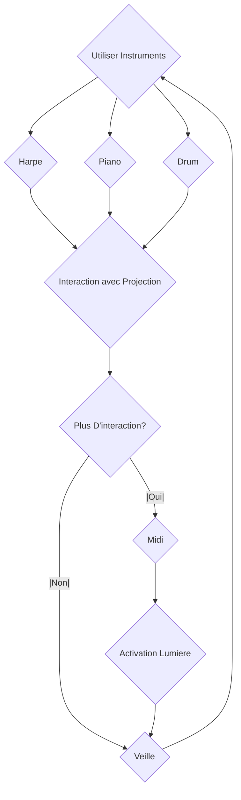
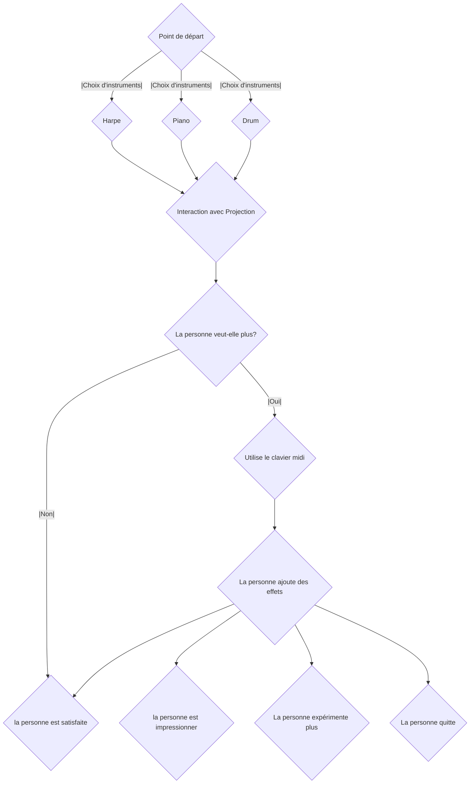
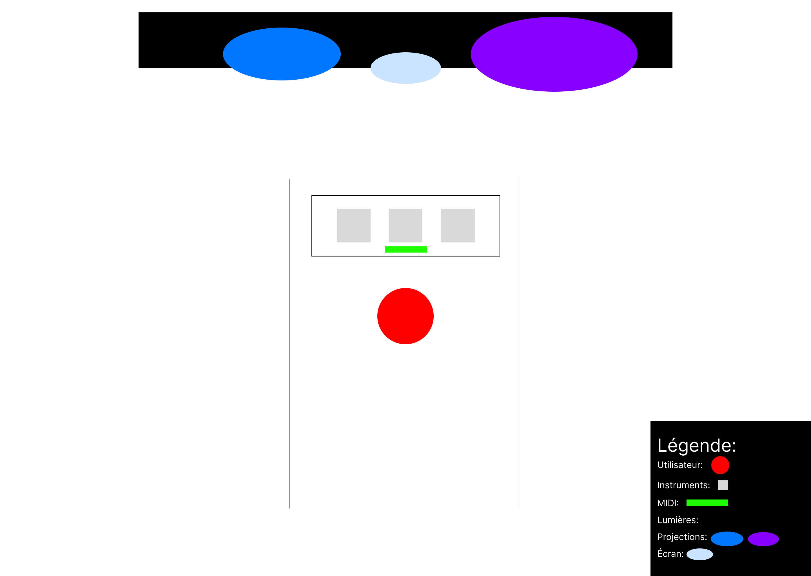

# Interconectado 

## Idée

### Concept
Avoir des petites sculptures qui auront des projecteurs ainsi qu'un écran au centre. Ces projecteurs projecteront sur les sculptures, l'écran projectera un visuel et seront accompagnés par de l'audio. Ce qui sera projeté sera aussi affecter par l'audio. Celui-ci est contrôler par des instruments. Puis, un clavier midi sera au centre pour mettre plus d'effets, et des indicateurs lumières sur les côtés guideront et démontreront l'effet.

### Objectifs
D'interconnecter les utilisateurs avec la musique et d'illustrer les impacts que celle-ci peut avoir.

### Motivations 
La musique est un média/art qui est très présent dans nos vies, mais généralement, on a pas beaucoup de chance d'intéragir physiquement avec celui-ci. Interconectado permetterait de vivre cette intéraction physique. Elle sera renforcer par les visuels et démontrera l'impact de la musique qu'il a sur l'humain. Bref, un concert personnel qui sert à nous rapprocher de la musique.

## Scénario

### Interactif

### Narratif

### Expérience utilisateur

## Ambiance

### Planche d'ambiance visuelles

### Planche d'ambiance sonores 

Pour l'ambiance générale, je cherche quelque chose qui va de normal (instruments normal) vers des effets synth, etc. Le choix d'un son "synth" ou "synthwave" serait car le son est plutot cinématique et me marque beaucoup.

https://youtu.be/-ZuS0p2qRYo?t=55

https://youtu.be/iJjRTL1xcKI?t=138

## Références artistique
Donc l’esthétique va de quelque chose plus réaliste (sans effets) vers quelque chose de plus « synth ». Le visuel va renforcer cela, lorsqu’on va vers le synth, les visuels vont être plus abstrait. Les grosses références pour le projets sont les concerts. Certains de ces concerts on des visuels attrayant ce qui est une grosse qualité que je veux pour ceci.

https://youtu.be/VB7JBN37nlY?t=66

https://youtu.be/l1ZlwbHuhrU?si=L1T6LDgumUMcfn-r

https://youtu.be/lrJ2x7oOE5w?si=ycnQVbG8hp6aMAc-

## Technologies

### Support médiatique
Donc, il aurait quelques mp4 pour les bases des visuels, ensuite les instruments seront la source audio, et en midi il interagiront avec les autres logiciels (Touch Designer, reaper, Max) pour permettre une interaction visuelle et audiovisuelle.

### Matériel

#### Électronique
- 1 ou 2 projecteurs
- 1 Écran (Assez grosse taille)
- Plusieurs lumières
- Sculpture Abstraite (2-3)
- Pédale (Peut être une idée)
- Ordinateur
- Controlleur Midi
- Fils nécessaire pour connecter les éléments entre eux.

#### Instruments
- Akai MPK Mini Plus 37-key Keyboard
- EART Electric Guitar SSS Single Coil
- Donner Electric Drum Set

### Logiciels
Différents Logiciels seront utilisé pour que les projections, les instruments et les lumières intéragissents entre elles.

- Touch Designer (Pour la projection et l'intéraction sur les visuels)
- MadMapper (Pour mapper les visuels sur les sculptures)
- After Effects (Pour les visuels de bases de l'écran)
- QLC+ ou SoundSwitch (Pour les lumières et l'intéractivité avec celle-ci)
- Reaper ou Max (Pour la détection d’audio des instruments, et les effets sur celle-ci)

Ceci sont des suggestions, il faudrait faire des tests pour confirmer.
Le réseau de communication serait majoritairement midi car celle-ci est faite pour la détection d’audio d’instruments musicales.

