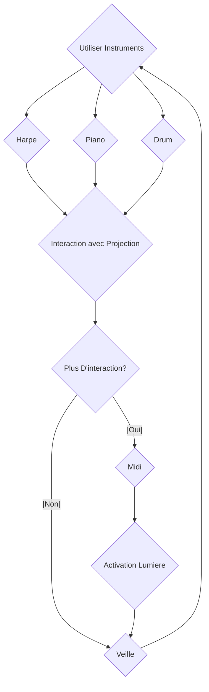

# Scénarisation 

## Idée

### Concept
Avoir des petites sculptures qui auront des projecteurs. Ces projecteurs projecteront sur les sculptures et seront accompagnés par de l'audio. Ce qui sera projeté sera aussi affecter par l'audio. Celui-ci est contrôler par des instruments. Puis, un clavier midi sera au centre pour mettre plus d'effets, et des indicateurs lumières sur les côtés guideront et démontreront l'effet.

### Objectifs
D'interconnecter les utilisateurs avec la musique.

### Motivations 
La musique est 

## Scénario

### Interactif

### Narratif

### Expérience utilisateur

## Ambiance

## Technologies

### Support médiatique

### Matériel

### Logiciels

