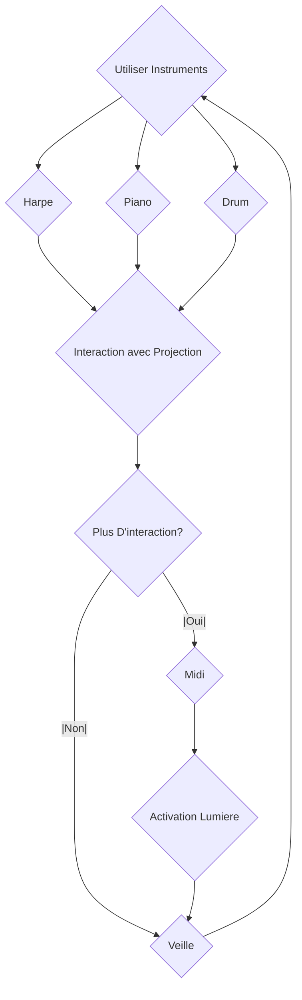
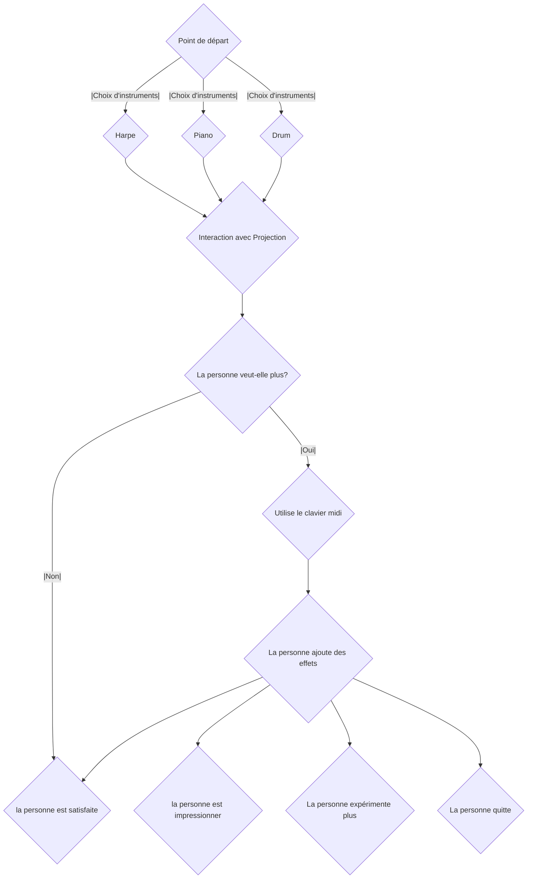

# Interconectado 

## Idée

### Concept
Avoir des petites sculptures qui auront des projecteurs ainsi qu'un écran au centre. Ces projecteurs projecteront sur les sculptures, l'écran projectera un visuel et seront accompagnés par de l'audio. Ce qui sera projeté sera aussi affecter par l'audio. Celui-ci est contrôler par des instruments. Puis, un clavier midi sera au centre pour mettre plus d'effets, et des indicateurs lumières sur les côtés guideront et démontreront l'effet.

### Objectifs
D'interconnecter les utilisateurs avec la musique et d'illustrer les impacts que celle-ci peut avoir.

### Motivations 
La musique est un média/art qui est très présent dans nos vies, mais généralement, on a pas beaucoup de chance d'intéragir physiquement avec celui-ci. Interconectado permetterait de vivre cette intéraction physique et de même renforcer par les visuels, l'impact de la musique qu'il a sur l'humain (un petit concert personel).

## Scénario

### Interactif

### Narratif

### Expérience utilisateur

## Ambiance

### Planche d'ambiance sonores 

Pour l'ambiance générale, je cherche quelque chose qui va de normal (instruments normal) vers des effets synth, etc. Le choix d'un son "synth" ou "synthwave" serait car le son est plutot cinématique et me marque beaucoup.
https://youtu.be/-ZuS0p2qRYo?t=55
https://youtu.be/iJjRTL1xcKI?t=138

## Références artistique
https://youtu.be/VB7JBN37nlY?t=66

## Technologies

### Support médiatique
Donc, il aurait quelques mp4 pour les bases de visuels, mais la vraie expérience se passe en 
### Matériel

Insturments
- Akai MPK Mini Plus 37-key Keyboard
- EART Electric Guitar SSS Single Coil
- Donner Electric Drum Set

### Logiciels
Différents Logiciels seront utilisé pour que les projections, les instruments et les lumières intéragissents entre elles.

- Touch Designer (Pour la projection et l'intéraction sur les visuels)
- MadMapper (Pour mapper les visuels sur les sculptures)
- After Effects (Pour les visuels de bases de l'écran)
- QLC+ ou SoundSwitch (Pour les lumières et l'intéractivité avec celle-ci)

